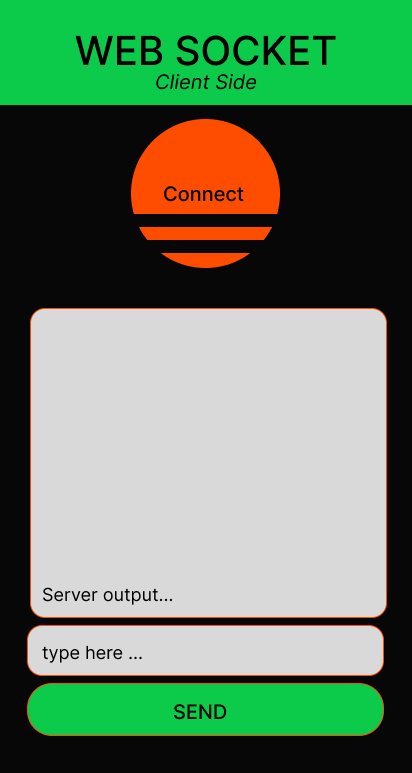

# web_workshop
local wifi websocket app, for basic communication with an arduino board.  
Meant to be used as a baseline for future projects that would need to use similar communication methods.

## The site map on paper
  

## Figma preview
**PC**
  

**Mobile**  

## Demo:
<html>
  <video width="720" height="480" controls>
    <source src="Docs/Websocket_Demo.mp4" type="video/mp4">
  </video>
</html>

